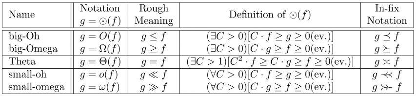

# Introduction

## Asymptotics

| Name        | Notation        | Rough Meaning | Definition                                     | In-fix Notation |
| ----------- | --------------- | ------------- | ---------------------------------------------- | --------------- |
| big-Oh      | $$g=O(f)$$      | $$g \le f$$   | $$(\exists C > 0)[C f \ge g \ge 0(e.v.)]$$     | $$g \preceq f$$ |
| big-Omega   | $$g=\Omega(f)$$ | $$g \ge f$$   | $$(\exists C > 0)[C g \ge f \ge 0(e.v.)]$$     | $$g \succeq f$$ |
| Theta       | $$g=\Theta(f)$$ | $$g = f$$     | $$(\exists C > 1)[C^2 f \ge C g \ge 0(e.v.)]$$ | $$g \asymp f$$  |
| small-oh    | $$g=o(f)$$      | $$g \ll f$$   | $$(\forall C > 0)[C f \ge g \ge 0(e.v.)]$$     | $$g \ll f$$     |
| small-omega | $$g=\omega(f)$$ | $$g \gg f$$   | $$(\forall C > 0)[C g \ge f \ge 0(e.v.)]$$     | $$g \gg f$$     |

## Stirling's Approximation

Original:

$$\sqrt{2\pi n}({n \over e})^n e^{1\over{12n + 1}} < n! < \sqrt{2\pi n}({n \over e})^n e^{1\over{12n}} $$

$$log(n!) = n log(n) - n + \Theta(log(n))$$

Further simplification:

$$log(n!) = \Theta(n log(n))$$

A possible transformation:

$$n! = \Theta(e^{n log(n)})$$

## Comparison Tree

### Hasse Diagram
