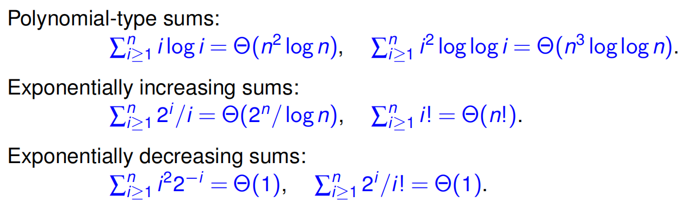

# Recurrences

Separable form for recurrence relation:

$$
\begin{gather*}
T(n) = G(n, T(n_1), ..., T(n_k))
\end{gather*}
$$

where $$G(x_0, x_1, ..., x_k)$$ is a function in $$k+1$$ variables and each
$$n_i (i=1,...,k)$$ is a function of $$n$$ that is strictly less than $$n$$.

**Fibonacci sequence** is defined by the recurrence relation:

$$
\begin{gather*}
F(n) = F(n-1) + F(n-2)
\end{gather*}
$$

For this, we have $$k=2, n_1=n-1, n_2=n-2$$

$$
\begin{gather*}
G(n, x, y) = x + y
\end{gather*}
$$

**Merge sort** complexity:

$$
\begin{gather*}
T(n) = n + 2T(n/2)
\end{gather*}
$$

For this, we have $$k=1, n_1=n/2$$

$$
\begin{gather*}
G(n, x) = n + 2x
\end{gather*}
$$

## Rote Method



Related homework questions: h2-Q7



### EGVS method

4 stages: **E**xpand, **G**uess, **V**erify and **S**top-and-Sum.

**Example:**

$$T(n) = 2T(n/2) + n$$

1. Expand:

   $$
   \begin{align*}
   T(n) &= 2T(n/2) + n \\
   &= 2 (2 T(n/4) + (n/2)) + n \\
   &= 4 T(n/4) + 2n \\
   &= 4 (2T(n/8) + (n/4)) + 2n \\
   &= 8T(n/8) + 3n \\
   &= \dots
   \end{align*}
   $$

2. Guess:

   $$
   \begin{gather*}
   T(n) = 2^i T({n\over{2^i}}) + i n
   \end{gather*}
   $$

3. Verify: (use natural induction)

   Base case: $$T(n)_{i=1} = 2T(n/2) + n$$ holds

   Inductive step: Assume $$T(n)_{i=k}$$ holds, the goal is to prove
   $$T(n)_{i=k+1}$$ also holds.

   $$
   \begin{align*}
   T(n) &= 2^k T({n\over{2^k}}) + k n \\
   &= 2^k (2 T({n\over{2^{k+1}}}) + {n\over{2^k}}) + k n \\
   &= 2^{k+1} T(n/2^{k+1}) + （k+1) n
   \end{align*}
   $$

   Therefore, this proves $$T(n)_{i=k+1}$$ also holds.

   Combining the base case and the inductive step we verified that $$ T(n) = 2^i
   T({n\over{2^i}}) + i n$$.

4. Stop:

   We can pick $$i = \lfloor {lg n} \rfloor$$ for stopping, then
   $$0 < {n\over{2^i}} \le 2$$.

   By DIC, choose $$T(n) = 0$$ for all $$n \le 2$$.

   Therefore, for $$n > 1$$,

   $$
   \begin{gather*}
   T(n) = \lfloor {lg n} \rfloor n
   \end{gather*}
   $$

### Basic Sums

Other kinds of sums are often reduces to the following forms.

#### Arithmetic Sums

$$
\begin{gather*}
S^k_n := \sum^n_{i=1}{i^k}
\end{gather*}
$$

Solution: $$S^k_n = \Theta(n^{k+1})$$

#### Geometric Sums

When $$x \ne 1$$,

$$
\begin{gather*}
S_n(x) := \sum^{n-1}_{i=0}{x^i}
\end{gather*}
$$

Solution: $$S_\infty = {{x^n - 1}\over{x - 1}}$$

#### Infinite Geometric Series

When $$\lvert{x}\rvert < 1$$,

$$
\begin{gather*}
S_{\infty}(x) := \sum^{\infty}_{i=0}{x^i}
\end{gather*}
$$

Solution: $$S_{\infty}={1\over{1 - x}}$$

#### Harmonic Series

$$
\begin{gather*}
H_n := 1 + {1\over{2}} + {1\over{3}} + \dots + {1\over{n}}
\end{gather*}
$$

Solution: $$H_n = ln(n) + g(n)$$ where $$0 < g(n) < 1$$.

## Summation Techniques

### Growth Types



Related homework questions: h3-Q1



#### Polynomial Type

A real function $$f$$ is **polynomial-type** if $$f$$ is non-decreasing (ev.)
and there is some $$C > 1$$ such that:

$$
\begin{gather*}
f(x) \le C f(x/2)\ (ev.)
\end{gather*}
$$

#### Increasing Exponential Type

$$f$$ increases exponentially if there exists real numbers $$C > 1$$ and
$$k > 0$$ such that:

$$
\begin{gather*}
f(x) \ge C f(x - k)\ (ev.)
\end{gather*}
$$

#### Decreasing Exponential Type

$$f$$ decreases exponentially if there exists real numbers $$C > 1$$ and
$$k > 0$$ such that:

$$
\begin{gather*}
f(x) \le f(x - k) / C\ (ev.)
\end{gather*}
$$

#### Lemma 8: Closed Properties

(a) **Polynomial-type** functions are closed under addition, multiplication, and
raising to any positive power $$a > 0$$.

(b) **Exponential-type** functions $$f$$ are closed under addition,
multiplication, and raising to any power $$a$$. In case $$a > 0$$, the function
$$f^a$$ will not change its subtype (increasing or decreasing). In case
$$a < 0$$, the function $$f^a$$ will change its subtype.

(c) If $$f$$ is polynomial-type and $$lg f$$ is non-decreasing then $$lg f$$ is
also polynomial-type. If $$f$$ is exponential-type and $$a > 1$$ then so is
$$a ^ f$$.

### Summation Rules by Growth Type



Related homework questions: h3-Q2



Theorem 6: Summation Rules

$$
S_f(n) = \Theta
\begin{cases}
  n f(n) & \text{if f is polynomial-type,} \\
  f(n) & \text{if f is increasing exponentially,} \\
  1 & \text{if f is decreasing exponentially.}
\end{cases}
$$

Examples:

- Polynomial Sums:

  $$
  \sum^n_{i\ge{1}}{i log(i)} = \Theta(n^2 log(n)), \sum^n_{i\ge{1}}{log(i)} = \Theta(n log(n)), \sum^n_{i\ge{1}}{i^a} = \Theta(n^{a+1})(a\ge{0}).
  $$

- Exponentially Increasing Sums:

  $$
  \sum^n_{i\ge{1}}{b^i} = \Theta(b^n)(b\ge{0}), \sum^n_{i\ge{1}}{i^{-5}2^{2^i}} = \Theta(n^{-5}2^{2^n}), \sum^n_{i\ge{1}}{i!} = \Theta(n!).
  $$

- Exponentially Decreasing Sums:

  $$
  \sum^n_{i\ge{1}}{b^{-i}} = \Theta(1)(b\ge{0}), \sum^n_{i\ge{1}}{i^2 i^{-i}} = \Theta(1), \sum^n_{i\ge{1}}{i^{-i}} = \Theta(1).
  $$

## Transformation Techniques

### Domain Transformation



Related homework questions: h3-Q3 and h3-Q4(combining range transformation)



Example:

Consider:

$$
\begin{gather*}
T(N) = T(N/2) + N
\end{gather*}
$$

We define $$t(n) := T(2^n) \text{or} N = 2^n$$.

This transforms the original N-domain into the n-domain:

$$
\begin{align*}
T(2^n) &= T(2^n/2) + 2^n \\
T(2^n) &= T(2^{n-1}) + 2^n \\
t(n) &= t(n-1) + 2^n
\end{align*}
$$

We get this standard form. By DIC, we choose the boundary condition $$t(n) = 0$$
for all $$n \le 0$$.

We get sum:

$$
\begin{gather*}
t(n) = \sum^n_{i\ge{0}}{2^n}=\Theta(2^n)
\end{gather*}
$$

Because we have $$n = lgN$$,

$$
\begin{gather*}
T(N) = \Theta(N)
\end{gather*}
$$



On Lecture II Page 46, L1120, we get the exact sum by transforming the
descending sum to the ascending sum.



### Range Transformation



Related homework questions: h3-Q4(combining domain transformation)



Example:

$$
\begin{gather*}
T(n) = 2T(n-1) + n
\end{gather*}
$$

We define $$t(n) := {T(n)\over{2^n}}$$, then divide the both sides of the
original equation by $$2^n$$.

$$
\begin{align*}
{T(n)\over{2^n}} &= 2{T(n-1)\over{2^n}} + {n\over{2^n}} \\
{T(n)\over{2^n}} &= {T(n-1)\over{2^{n-1}}} + {n\over{2^n}} \\
t(n) &= t(n-1) + {n\over{2^n}}
\end{align*}
$$

We get this standard form. By DIC, we choose the boundary condition $$t(n) = 0$$
for all $$n \le 0$$.

We get sum: ($$\sum^n_{i\ge{0}}{n\over{2^n}}$$ is exponentially decreasing)

$$
\begin{gather*}
t(n) = \sum^n_{i\ge{0}}{n\over{2^n}}=\Theta(1)
\end{gather*}
$$

Because $$t(n) = {T(n)\over{2^n}}$$,

$$
\begin{gather*}
T(n) = \Theta(2^n)
\end{gather*}
$$



## Master Theorem



Related homework questions: h2-Q8



**Master recurrence:**

$$
\begin{gather*}
T(n) = a T(n/b) + d(n)
\end{gather*}
$$

where $$a > 0$$, $$b > 0$$ are real constants and $$d(n)$$ the driving/forcing
function.

**Watershed constant**

$$w = log_b(a)$$

**Watershed function**

$$W(n) = n^w = n^{log_b(a)}$$

### Master Theorem

Theorem 10: Master Theorem on Lecture II Page 51, L1207

$$
\begin{gather*}
T(n) = \Theta
\begin{cases}
  n^w, & \text{if } d(n) = O(n^{w-\epsilon}) \text{ for some } \epsilon > 0, & CASE(-) \\
  n^w log(n), & \text{if } d(n) = \Theta(n^w), & CASE(0) \\
  d(n), & \text{if } a\cdot d(n/b) \le c\cdot d(n) \text{ for some } 0 < c < 1. & CASE(+) \\
\end{cases}
\end{gather*}
$$

### Extended Master Theorem

Theorem 12: Extended Master Theorem on Lecture II Page 54, L1282

$$
\begin{gather*}
T(n) = \Theta
\begin{cases}
  d(n), & \text{if } a\cdot d(n/b) \le c\cdot d(n) \text{ for some } 0 < c < 1. & CASE(+) \\
  W(n)loglogn, & \text{if } d(n) = \Theta(W(n)log^c(n)) \text{ for } c = -1, & CASE(1) \\
  W(n)log^{c+1}(n), & \text{if } d(n) = \Theta(W(n)log^c(n)) \text{ for } c > -1, & CASE(0) \\
  W(n), & \text{if } d(n) = O(W(n)log^c(n)) \text{ for } c < -1. & CASE(-) \\
\end{cases}
\end{gather*}
$$

## Multi-term Master Recurrences



Related homework questions: h3-Q5



$$
\begin{gather*}
T(n) = d(n) + \sum_{i=1}^{k}{a_i T(n/b_i)}
\end{gather*}
$$

where $$a_i > 0$$ and $$b_1 > b_2 > \cdots > b_k > 1$$ are real constants.

**Watershed constant**

It is the real number $$\alpha$$ such that:

$$
\begin{align*}
1 = \sum_{i=1}^{k}{a_i\over{b_i^{\alpha}}}
\end{align*}
$$

It clearly exists and is unique.

## Real Induction
