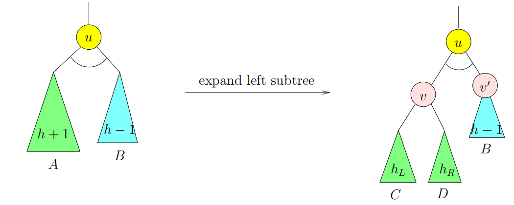
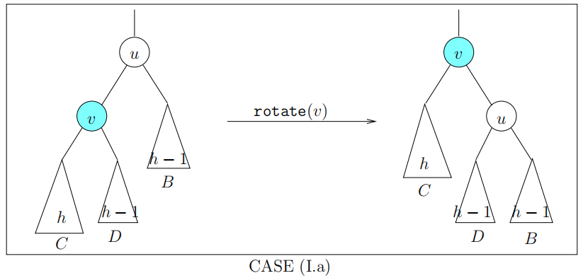
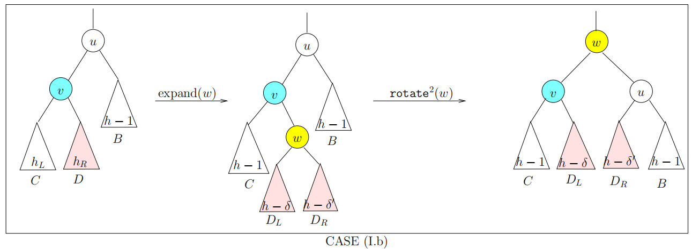
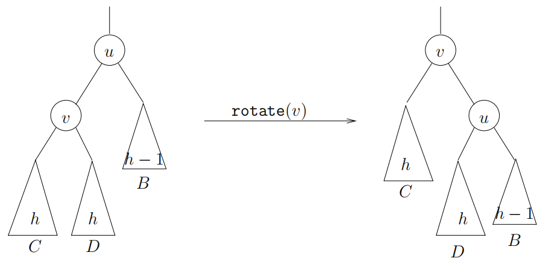

# Search Trees

## Binary Search Trees (BST)

### Binary Tree

A binary tree $$T$$ is a set $$N$$ of nodes where each node $$u_0$$ has two
pointers, $$u_0$$.left and $$u_0$$.right.

The size of $$T$$ is $$|N|$$.

**Complete Binary Tree**

Every level of the tree is completely filled, except possibly the last level.
Moreover, the last level has to be filled from left to right.

If a complete binary tree is also complete on the last level, then it is called
a **perfect** binary tree.

**Height of binary trees**

Minimum number of nodes in a binary tree of height $$h$$:

$$
\begin{gather*}
\mu(h) = h + 1
\end{gather*}
$$

Maximum number of nodes in a binary tree of height $$h$$:

$$
\begin{gather*}
M(h) = 2^{h+1} - 1
\end{gather*}
$$

The minimum height of binary trees with $$n$$ nodes:

$$
\begin{gather*}
h \ge \lg(n + 1) - 1
\end{gather*}
$$

### Binary Search Tree

A binary tree is a binary search tree if each node $$u \in T$$ has a field
$$u$$.key that satisfies the BST property:

$$
\begin{gather*}
u_L.key < u.key \le u_R.key
\end{gather*}
$$

## AVL Trees

An AVL tree is a binary search tree where the left subtree and right subtree at
each node differ by at most 1 in height.

### Balance Factor

More generally, define the **balance** of any node $$u$$ of a binary tree to be
the height of the left subtree minus the height of the right subtree:

$$
\begin{gather*}
b(u) = h(u.left) - h(u.right)
\end{gather*}
$$

### Insertion and Deletion Algorithms

**UPDATE PHASE**: Insert or delete as we would in a binary search tree.

**REBALANCE PHASE**: Let $$x$$ be parent of the node that was just inserted, or
just cut during deletion, in the UPDATE PHASE. THe path from $$x$$ to the root
will be called the **rebalance path**. We now move up this path, rebalancing
nodes along this path as necessary.

Let $$u$$ be the first unbalanced node we encounter along the rebalance path
from bottom to top. It is clear that $$u$$ has a balance of $$\pm 2$$. The
situation is illustrated below:

#### Insertion Rebalancing

CASE (I.a): $$h_L = h$$ and $$h_R = h - 1$$. This means that the inserted node
is in the left subtree of $$v$$. In this case, we rotate $$v$$, the result would
be balanced. Moreover, the height of $$u$$ is now $$h+1$$. We call this the
"single-rotation" case.

CASE (I.b): $$h_L = h - 1$$ and $$h_R = h$$. This means that the inserted node
is in the right subtree of $$v$$. In this case, let us expand the subtree $$D$$
and let $$w$$ be its root. The two children of $$w$$ will have heights
$$h - \delta$$ and $$h - \delta'$$ where $$\delta, \delta' \in \{1, 2\}$$. Now a
double-rotation at $$w$$ results in a balanced tree of height $$h+1$$ rooted at
$$w$$.

#### Deletion Rebalancing

CASE (D.a): $$h_L = h$$ and $$h_R = h - 1$$. This is like case (I.a) and treated
in the same way, namely a single rotation at $$v$$. Now $$u$$ is replaced by
$$v$$ after this rotation, and the new height of $$v$$ is $$h+1$$. Now $$u$$ is
AVL balanced. However, since the original height is $$h + 2$$, there may beb
unbalanced node further up the rebalance path. Thus, this is a non-terminal
case.

CASE (D.b): $$h_L = h - 1$$ and $$h_R = h$$. This is like case (I.b) and treated
in the same way, namely a double rotation at $$w$$. Again, this is a
non-terminal case.

CASE (D.c): $$h_L = h_R = h$$. This case is new, we simply rotate at $$v$$. We
check that $$v$$ is balanced and has height $$h+2$$. Since $$v$$ is in the place
of $$u$$ which has height $$h+2$$ originally, we can safely terminate the
rebalancing process.

